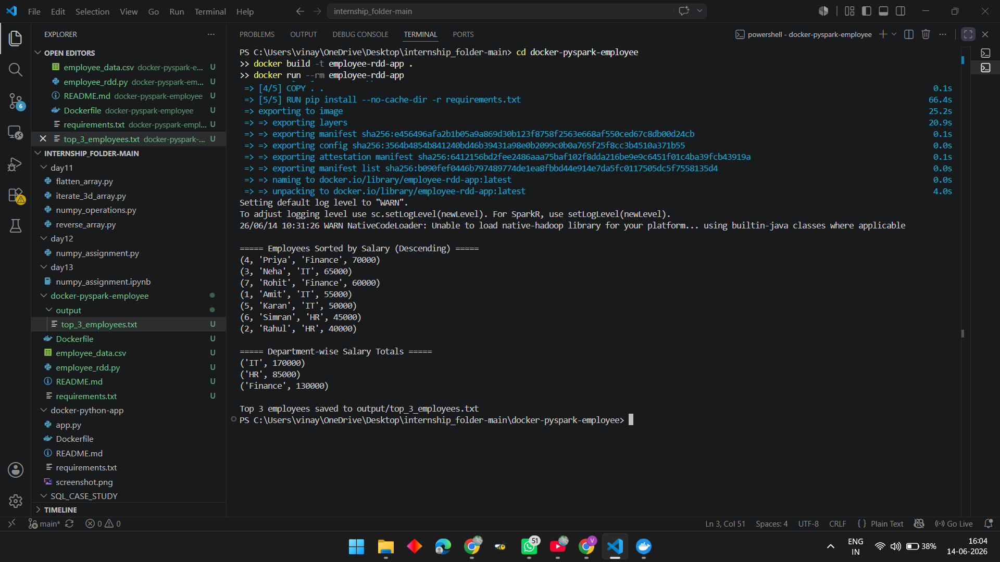

# PySpark Employee RDD Processing

## Objective

Process employee data using PySpark RDD operations.

### Tasks

1. Read CSV into RDD.
2. Sort employees by salary in descending order.
3. Calculate department-wise salary totals.
4. Save top 3 highest-paid employees to a file.
5. Containerize application using Docker.

---

## Build Docker Image

```bash
docker build -t employee-rdd-app .
```

## Run Docker Container

```bash
docker run --rm employee-rdd-app
```

---

## Output

### Department Salary Totals

IT = 170000

HR = 85000

Finance = 130000

### Top 3 Highest Paid Employees

1. Priya - 70000
2. Neha - 65000
3. Rohit - 60000

# Screenshots

## Docker Build and Run Output



## Output File

The top 3 highest-paid employees are saved in:

output/top_3_employees.txt